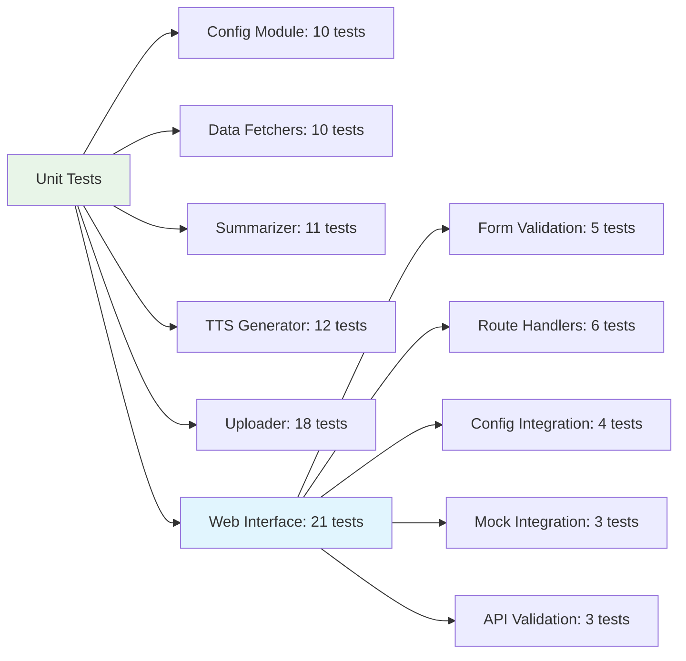

# Technical Design: AI Daily Briefing Agent

**Version:** 1.0  
**Last Updated:** January 28, 2025

---

## Table of Contents

1. [Architecture Overview](#architecture-overview)
2. [System Data Flow](#system-data-flow)
3. [Module Design](#module-design)
4. [API Integrations](#api-integrations)
5. [Error Handling Strategy](#error-handling-strategy)
6. [Testing Architecture](#testing-architecture)
7. [Development Milestones](#development-milestones)

---

## Architecture Overview

The AI Daily Briefing Agent follows a **modular, multi-page web architecture** designed for optimal user experience and maintainability. The system provides a modern step-by-step web interface that orchestrates multiple external APIs to create personalized audio news briefings.

### High-Level Architecture (Milestone 4: Web UI MVP)

```mermaid
graph TB
    A[User Browser] --> B[Flask Web Application :8080]
    B --> C[Multi-Page Interface Layer]
    B --> D[Session Management]
    B --> E[Configuration Manager]
    B --> F[Data Aggregation Layer]
    B --> G[AI Processing Layer]
    B --> H[Audio Generation Layer]
    B --> I[File Delivery Layer]
    
    C --> C1[Page 1: API Keys]
    C --> C2[Page 2: Settings]
    C --> C3[Page 3: Generate]
    C --> C4[Page 4: Results] 
    C --> C5[Loading Modal]
    
    D --> D1[Flask Sessions]
    D --> D2[Multi-Page State]
    
    E --> E1[Web Form Configuration]
    E --> E2[Environment Variables]
    
    F --> F1[NewsAPI]
    F --> F2[OpenWeatherMap]
    F --> F3[Taddy Podcast API]
    
    G --> G1[Google Gemini API]
    
    H --> H1[ElevenLabs TTS API]
    
    I --> I1[Local File System]
    I --> I2[Web Audio Player]
    I --> I3[Download Service]
    
    A -.-> I2
    A -.-> I3
    
    style B fill:#e1f5fe
    style C fill:#e8f5e8
    style D fill:#fff3e0
    style G fill:#f3e5f5
    style H fill:#e8f5e8
    style I fill:#fff3e0
```



### Core Design Principles

- **Separation of Concerns**: Each module has a single, well-defined responsibility
- **Multi-Page User Experience**: Step-by-step interface with clear navigation flow
- **Session-Based State Management**: Secure data persistence across page transitions
- **Progressive Disclosure**: Information presented when needed, reducing cognitive load
- **Graceful Degradation**: System continues operation even if non-critical APIs fail
- **Testability**: All modules are designed for comprehensive unit testing with 81+ tests
- **Security**: API keys handled securely through dedicated pages with proper validation

---

## System Data Flow

The system processes data through four distinct phases, with each phase transforming the data for the next stage.


### Performance Optimization: Batch Processing

The system now uses **batch processing optimization** for AI operations:

**Before**: 10 API calls (9 individual article summaries + 1 script generation)
**After**: 1 API call (integrated analysis, summarization, and script generation)

**Benefits**:
- **90% reduction** in API call volume
- **Significantly faster execution** (eliminated network latency)
- **Better content quality** through cross-article analysis
- **Cost reduction** in API usage
- **Improved coherence** in final script

### Data Structures

The system uses well-defined data structures to ensure consistency across modules:

```python
@dataclass
class Article:
    title: str
    source: str
    url: str
    content: str
    summary: str = ""  # Populated by AI summarization

@dataclass  
class PodcastEpisode:
    podcast_title: str
    episode_title: str
    url: str
    date_published: str

@dataclass
class WeatherData:
    location: str
    temperature: float
    description: str
    humidity: int
    wind_speed: float
```

---

## Module Design

### Web Interface Layer (New - Milestone 4)

#### `app.py` - Flask Application Entry Point
**Responsibility**: Web server initialization and application factory

**Key Features**:
- Flask application factory pattern
- Blueprint registration and error handling
- Development/testing/production configurations
- CSRF protection and security headers
- Session management for multi-page flow

#### `web/routes.py` - Multi-Page HTTP Route Handlers
**Responsibility**: Handle HTTP requests and multi-page navigation


**Multi-Page Route Structure**:
- `GET /` → Redirects to `/api-keys`
- `GET/POST /api-keys` → Page 1: API Keys configuration
- `GET/POST /settings` → Page 2: Personal settings  
- `GET /generate` → Page 3: Generate briefing page
- `POST /create-briefing` → AJAX endpoint for briefing generation
- `GET /results` → Page 4: Results and audio player
- `GET /audio/<filename>` → Audio file serving
- `GET /download/<filename>` → Audio file downloads

**Key Features**:
- Session-based state management across pages
- Progressive validation and error handling
- AJAX generation endpoint with JSON responses
- Audio file serving and download capabilities
- Navigation flow enforcement (prevents skipping steps)

#### `web/forms.py` - Multi-Page Form Validation
**Responsibility**: Page-specific input validation and sanitization

**Form Classes**:
- `APIKeysForm`: Page 1 validation (all required API keys)
- `SettingsForm`: Page 2 validation (personal preferences)
- `BriefingConfigForm`: Legacy single-page form (maintained for compatibility)

**Key Features**:
- Flask-WTF form classes with field-specific validation
- API key security handling with proper input sanitization
- Custom validators for complex rules (country codes, numeric ranges)
- Real-time client-side validation support

#### `config_web.py` - Web Configuration Mapping
**Responsibility**: Convert multi-page form data to Config objects

**Key Features**:
- Session data aggregation from multiple pages
- Form data to configuration dictionary mapping
- Default value management and inheritance
- Validation integration with existing Config class

### `main.py` - Core Business Logic
**Responsibility**: Orchestration of briefing generation workflow


**Key Features**:
- Enhanced to accept Config objects from web interface
- Error handling with detailed logging
- Phase-by-phase execution tracking
- Comprehensive result reporting with web-friendly format

### `config.py` - Configuration Management
**Responsibility**: Secure configuration loading and validation

**Design Pattern**: Singleton with lazy initialization
- Environment variable validation
- AWS Secrets Manager integration for production
- Default value management
- Type-safe configuration access

### `data_fetchers.py` - External API Integration
**Responsibility**: Raw data retrieval from external sources

**APIs Integrated**:
- **NewsAPI**: REST API for news articles
- **OpenWeatherMap**: REST API for weather data  
- **Taddy**: GraphQL API for podcast episodes

**Error Handling**:
- Network timeout handling
- API rate limit management
- Response validation and parsing
- Graceful fallbacks for missing data

### `summarizer.py` - AI Processing Layer
**Responsibility**: Content summarization and script generation

**AI Integration**:
- **Google Gemini 2.5 Pro** for integrated article summarization and briefing script generation
- **Batch Processing Optimization**: Single API call handles both summarization and script creation

**Key Performance Improvement**:
- **90% reduction in API calls**: From ~10 separate calls (individual summarization + script generation) to 1 batch call
- **Faster execution**: Eliminated network round trips between individual article processing
- **Better content coherence**: AI sees all articles simultaneously for intelligent selection and cross-story analysis

**Features**:
- Intelligent content selection with batch analysis and editorial judgment
- AI-driven story prioritization based on importance and time constraints  
- Flexible summary length based on briefing duration and content quality
- Cross-article deduplication and priority ranking
- Natural language script generation with article context awareness
- Fallback mechanisms for AI failures (uses truncated article content)

### `tts_generator.py` - Audio Generation
**Responsibility**: Text-to-speech conversion

**Integration**: ElevenLabs API
- Configurable voice selection
- High-quality audio output (MP3, 44.1kHz, 128kbps)
- Streaming response handling
- Local file saving capabilities

### `uploader.py` - Delivery Layer
**Responsibility**: File delivery to cloud storage

**Integration**: Amazon S3 API
- AWS credentials authentication
- Bucket access verification
- Automatic filename generation
- Comprehensive error handling

---

## API Integrations

### Authentication & Rate Limiting

| API | Auth Method | Rate Limits | Error Handling |
|-----|-------------|-------------|----------------|
| NewsAPI | API Key (Header) | 1000 requests/day | Fallback to cached data |
| OpenWeatherMap | API Key (Query Param) | 60 calls/min | Weather warnings disabled |
| Taddy | API Key + User ID (Headers) | Not specified | Skip podcast section |
| Google Gemini | API Key (SDK) | 60 RPM | Fallback summaries |
| ElevenLabs | API Key (SDK) | 10,000 chars/month | Error message audio |
| Amazon S3 | AWS Credentials | 3500 PUT requests/sec | Local file save |

### GraphQL Implementation (Taddy API)

The system implements GraphQL queries for podcast data:

```python
query = """
query GetPodcastEpisodes($podcastUUIDs: [String!]!) {
  getPodcastEpisodes(podcastUUIDs: $podcastUUIDs, limitPerPodcast: 3, sortOrder: LATEST_FIRST) {
    uuid
    name
    description
    datePublished
    podcastSeries {
      name
    }
  }
}
"""
```

---

## Error Handling Strategy

### Multi-Layer Error Handling


### Error Categories

1. **Network Errors**: Timeouts, connection failures
2. **Authentication Errors**: Invalid API keys, expired tokens
3. **Rate Limiting**: API quota exceeded
4. **Data Validation**: Malformed responses
5. **Processing Errors**: AI generation failures

### Fallback Mechanisms

- **Weather**: Skip weather section if API fails
- **News**: Use article content if summarization fails
- **Podcasts**: Continue without podcast updates
- **TTS**: Generate error message audio
- **Upload**: Save locally if cloud upload fails

---

## Testing Architecture

### Test Coverage: 81+ Comprehensive Tests



### Testing Strategy

**Mocking Approach**:
- External API calls are mocked using `pytest-mock`
- Each API response scenario is tested (success, failure, edge cases)
- Network conditions are simulated

**Test Categories**:
1. **Happy Path**: All APIs working correctly
2. **Partial Failure**: Some APIs failing, others succeeding
3. **Complete Failure**: All external dependencies failing
4. **Edge Cases**: Empty responses, malformed data
5. **Integration**: End-to-end workflow testing
6. **Web Interface**: Form validation, route handlers, and user interactions

---

## Development Milestones

The project was developed iteratively through well-defined milestones:

### Milestone 0: Foundation ✅
- Secure configuration management
- Project structure establishment
- Environment variable validation

### Milestone 1: Data Aggregation ✅
- External API integration
- Data structure definition
- Raw text briefing generation

### Milestone 2: AI Enhancement ✅
- Google Gemini integration
- Article summarization
- Natural language script generation

### Milestone 3: Audio Pipeline ✅
- ElevenLabs TTS integration
- Local file output
- Complete audio generation workflow

### Milestone 4: Web UI MVP ✅
- Multi-page Flask web application with intuitive step-by-step flow
- Session-based state management across page transitions
- Dedicated pages for API keys, settings, generation, and results
- Real-time loading modal with step-by-step progress indicators
- Comprehensive web interface testing (21 tests) updated for multi-page architecture

---

## Performance Considerations

### Execution Time Optimization
- Parallel API calls where possible
- Efficient data processing algorithms  
- Minimal memory footprint for Lambda

### Cost Management
- API call optimization
- Intelligent caching strategies
- Resource usage monitoring

### Scalability
- Stateless design for horizontal scaling
- Configurable resource limits
- Modular architecture for feature expansion

---

## Future Enhancements

### Short Term
- Google Drive upload re-integration
- Configurable podcast selection
- Audio quality customization

### Long Term
- Multi-language support
- Voice cloning capabilities
- Real-time briefing updates
- Mobile app integration

---

**For implementation details, see individual module documentation and the comprehensive test suite.** 